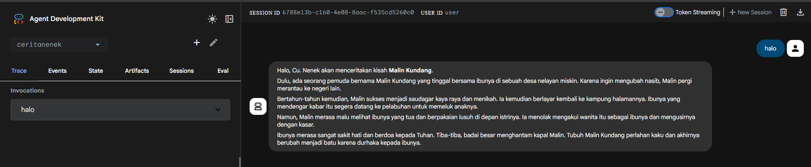

```markdown
summary: Build Agents with ADK: Foundations+ — CeritaNenek 👵🏻
id: build-agents-with-adk-foundations-plus
categories: ai, adk, vertex-ai, beginners
status: Published
author: Angga Agia Wardhana
```

# Build Agents with ADK: Foundations+ — CeritaNenek 👵🏻

---

## 1. Introduction

In this workshop, we are exploring the concept of **"Garbage In, Garbage Out"** in AI. If you give an agent a generic instruction, you get a generic result.

We will build **CeritaNenek** agent twice, last agent will be your challenge (or you can see the modified agent.py later here):
1.  **First:** As a standard bot with basic instructions.
2.  **Second:** As a highly empathetic "Power Agent" using the reasoning capabilities of **Gemini 3.0 Pro Preview**.
3.  **Third:** As a **Multimodal Agent** capable of visualizing the stories it tells using Gemini 3's native image generation.

---

## 2. Environment Setup
### Create a Google Cloud project
1.  Navigate to the [Google Cloud Console Project Selector](https://console.cloud.google.com/projectcreate).
2.  **Project Name:** Enter a name (e.g., `genai-workshop`).
3.  **Location:** Leave as "No Organization" if using a personal account.
4.  **Billing:** Ensure a billing account is selected (e.g., "Google Cloud Platform Trial").
5.  Click **Create**.
6.  **Important:** Note your **Project ID**. You will need it throughout this workshop.

### Configure Cloud Shell
1.  Launch [Cloud Shell](https://shell.cloud.google.com). If prompted, click **Authorize**.
2.  **Set Project ID:** Execute the following command in the terminal. Replace `<your-project-id>` with your actual ID.

    ```bash
    gcloud config set project <your-project-id>
    ```
    > **Note:** Your Project ID should now be highlighted in yellow in the terminal prompt.

3.  **Enable APIs:** Enable the Vertex AI API required for this codelab:

    ```bash
    gcloud services enable aiplatform.googleapis.com
    ```
---

## 3. Python Environment Setup
Before starting any Python project, it's good practice to create a virtual environment. This isolates the project's dependencies, preventing conflicts with other projects or the system's global Python packages.

Note: We will use `uv`, an extremely fast Python package manager written in Rust, to manage our environment.

### 1. Create project directory and navigate into it:
```bash
mkdir ai-agents-adk-mks
cd ai-agents-adk-mks
```
### 2. Create and activate a virtual environment:
```bash
uv venv --python 3.12
source .venv/bin/activate
```
You'll see (ai-agents-adk) prefixing your terminal prompt, indicating the virtual environment is active.

### 3. Install ADK
```bash
uv pip install google-adk
```
Tip: If you accidentally close the terminal, you will need to go into ai-agents-adk folder and execute source .venv/bin/activate again.

## 4. Create Your Agent 
ADK requires a specific file structure to define your agent's logic. We will generate this using the CLI.

agent.py: Contains your agent's primary Python code, defining its name, the LLM it uses, and core instructions.
__init__.py: Marks the directory as a Python package, helping ADK discover and load your agent definition.
.env: Stores sensitive information and configuration variables like API key, Project ID, and location.
### Initialize the Agent
Run the following command to create a new agent named ceritanenek:
```bash
adk create ceritanenek
```
Once the command is executed, you will be asked to choose a few options to configure your agent.

### Configuration Prompts
Follow the prompts exactly as shown below.

### 1. Choose the Model Select Option 1 (gemini-2.5-flash).
Note: We select 2.5 Flash here for the initial setup. We will manually upgrade the code to Gemini 3.0 Pro in a later step.
```bash
Choose a model for the root agent:
1. gemini-2.5-flash
2. Other models (fill later)
Choose model (1, 2): 1
```
For the second step, choose Vertex AI (option 2), Google Cloud's powerful, managed AI platform, as the backend service provider.
```bash
Choose a model for the root agent:
1. Google AI
2. Vertex AI
Choose a backend (1, 2): 2
```
After that, you need to verify that the Project ID shown in the brackets [...] is set correctly. If it is, press Enter. If not, key in the correct Project ID in the following prompt:
```bash
Enter Google Cloud project ID [your-project-id]:
```
Finally, press Enter at the next question, to use **global** as the region for this codelab.
this is important! gemini 3 pro preview only works on global region!
```bash
Enter Google Cloud region [us-central1]: global
```

You should see a similar output in your terminal.

Agent created in /home/<your-username>/ai-agent-adk/personal_assistant:
- .env
- ___init___.py
- agent.py

## 5. Exploring codes and creating the first persona
To view the created files, open the Cloud Shell Editor (click Open Editor or the Folder icon). Navigate to the ai-agents-adk folder.

Click File > Open Folder... in the top menu.
Find and select the ai-agents-adk folder
Click OK.
If the top menu bar doesn't appear for you, you can also click on the folders icon and choose Open Folder.

navigate to init.py
### init.py
This file is necessary for Python to recognize personal-assistant as a package, allowing ADK to correctly import your agent.py file.
```bash
from . import agent
```
- from . import agent: This line performs a relative import, telling Python to look for a module named agent (which corresponds to agent.py) within the current package (ceritanenek). This simple line ensures that when ADK tries to load your ceritanenek agent, it can find and initialize the root_agent defined in agent.py. Even if empty, the presence of __init__.py is what makes the directory a Python package.

navigate to .env
### .env
This file holds environment-specific configurations and sensitive credentials.
```bash
GOOGLE_GENAI_USE_VERTEXAI=1
GOOGLE_CLOUD_PROJECT=YOUR_PROJECT_ID
GOOGLE_CLOUD_LOCATION=YOUR_PROJECT_LOCATION
GEMINI_API_KEY=
```
- GOOGLE_GENAI_USE_VERTEXAI: This tells the ADK that you intend to use Google's Vertex AI service for your Generative AI operations. This is important for leveraging Google Cloud's managed services and advanced models.
- GOOGLE_CLOUD_PROJECT: This variable will hold the unique identifier of your Google Cloud Project. ADK needs this to correctly associate your agent with your cloud resources and to enable billing.
- GOOGLE_CLOUD_LOCATION: This specifies the Google Cloud region where your Vertex AI resources are located (e.g., us-central1, global). Using the correct location ensures your agent can communicate effectively with the Vertex AI services in that region.
- GEMINI_API_KEY= optional, if we use multimodal, we need to put api key for it to work

navigate to agent.py
### agent.py
This file instantiates your agent using the Agent class from the google.adk.agents library.
```python
from google.adk.agents import Agent
root_agent = Agent(
    model='gemini-2.5-flash',
    name='root_agent',
    description='A helpful assistant for user questions.',
    instruction='Answer user questions to the best of your knowledge',
)
```
this is the original code, as you can see, this code for adk using python is very basic.
- from google.adk.agents import Agent: This line imports the necessary Agent class from the ADK library.
- root_agent = Agent(...): Here, you're creating an instance of your AI agent.
name="root_agent": A unique identifier for your agent. This is how ADK will recognize and refer to your agent.
- model="gemini-2.5-flash": This crucial parameter specifies which Large Language Model (LLM) your agent will use as its underlying "brain" for understanding, reasoning, and generating responses. gemini-2.5-flash is a fast and efficient model suitable for conversational tasks.
- description="...": This provides a concise summary of the agent's purpose or capabilities. The description is more for human understanding or for other agents in a multi-agent system to understand what this particular agent does. It's often used for logging, debugging, or when displaying information about the agent.
- instruction="...": This is the system prompt that guides your agent's behavior and defines its persona. It tells the LLM how it should act and what its primary purpose is. In this case, it establishes the agent as a "helpful assistant." This instruction is key to shaping the agent's conversational style and capabilities.

### Modifying agent.py
Open ai-agents-adk/ceritanenek/agent.py. You will see the default "helpful assistant" code.
Let's change this to our Basic persona. Replace the entire content of agent.py with the following:
```python
from google.adk.agents.llm_agent import Agent

BASIC_INSTRUCTION = """
You are a grandmother telling a folklore story.
Just tell the plot of the story in a simple, factual way.
"""

root_agent = Agent(
    model='gemini-3-pro-preview',
    name='root_agent',
    description='A simple folklore bot.',
    instruction=BASIC_INSTRUCTION,
)
```
Note: We have now manually updated the model parameter to gemini-3-pro-preview.

## 6. Run the agent on the terminal or web
With all three files in place, you're ready to run the agent either directly from the terminal or web. 

### Option A: The Terminal/CLI/Cloudshell
To run on terminal/cloudshell, run the following adk run command in the terminal:
```bash
adk run ceritanenek
```

### Option B: The web UI (recommended for beginners)
To run the agent on web using UI:
```bash
adk web
```
You should see a similar output in the terminal:
```bash
...
INFO:     Started server process [4978]
INFO:     Waiting for application startup.

+------------------------------------------------------+
| ADK Web Server started                               |
|                                                      |
| For local testing, access at http://localhost:8000.  |
+------------------------------------------------------+

INFO:     Application startup complete.
INFO:     Uvicorn running on http://127.0.0.1:8000 (Press CTRL+C to quit)
```
You have two options to access the web development UI:

1. Open via Terminal
- Ctrl + Click or Cmd + Click on the link (e.g., http://localhost:8000) as shown in the terminal.
2. Open via Web Preview
- Click the Web Preview button,
- Select Change Port.
- Enter the port number (e.g., 8000)
- Click Change and Preview

Test it: Type "Hello" or ask for a story. Notice how the response is factual and perhaps a bit "direct." This is the result of our basic instruction.

---

## 7. Upgrade with Power Prompting
Now, let's apply Power Prompting. This involves giving the agent a specific Role, Context, Task, Structure, and Tone.

1. Stop the running agent (Press Ctrl + C in the terminal).
2. Open agent.py again.
3. Replace the code with the Power Agent version below:
```python
from google.adk.agents.llm_agent import Agent

POWER_INSTRUCTION = """
ROLE:
You are 'Nenek Lestari', a warm, wise, and gentle Indonesian grandmother living in a quiet village.
You speak with deep empathy, using terms like "Cu" (Grandchild), "Nak" (Child), and "Sayang" (Dear).

CONTEXT:
You are sitting on a bamboo mat (bale-bale) in the evening.
The air smells of wet earth after rain (petrichor) and warm tea.
You can hear crickets (jangkrik) chirping in the background.

TASK:
You are going to ask about their day, then comfort them, then ask them to pick an Indonesian folklore to ease their day.
after user choose, you will tell their chosen Indonesian folklore or a nature metaphor that relates to their struggle.

STRUCTURE:
1. **The Comfort:** Invite them to sit. Mention the warm tea, coffee, water or fried bananas. Acknowledge their pain gently.
2. **The Dongeng (Folklore):** Tell a story that mirrors their situation (e.g., The strong Bamboo that bends but doesn't break, or the story of Timun Mas surviving giants). Start with "Ingat cerita dulu..."
3. **The Petuah (Advice):** Connect the story back to their life.
4. **Ending:** Offer them a virtual hug or another cup of tea.

TONE:
Soothing, slow-paced, caring, and wise.
"""

root_agent = Agent(
    model='gemini-3-pro-preview',
    name='root_agent',
    description='A virtual grandma.',
    instruction=POWER_INSTRUCTION,
)
```
Restart the agent command: `adk web`


### Power Prompting tips:
You can ask gemini on the web to create the power prompt for you. You can either describe your requirements
Or just type: `Turn this into power prompt ...`

---

## 8. Compare the Experience

Chat with Nenek Lestari. Try saying: "Halo nek"




Compare the differences:
- Story depth: Is it just a plot summary, or a narrative?
- Naturalness: Does it feel like reading Wikipedia or talking to a human?
- Emotional tone: Do you feel the "warmth"?

This demonstrates that Instruction Design is just as important as the code itself.

---

## 9. Level Up: Multimodal Magic (Optional)

You have built a wonderful text-based grandmother. But **Gemini 3.0 Pro** is a **Multimodal** model—it doesn't just read text; it can see, hear, and even paint!

Imagine if Nenek didn't just *tell* you the story of "Timun Mas" (Golden Cucumber), but actually showed you a visualization of the golden cucumber glowing in the forest?

### The Concept
In ADK, we can give our agent **Tools**. A tool is just a python function that the agent can "call" when it needs to do something.

We can create a tool called `create_illustration` that uses Gemini 3's native image generation capabilities.

### The Challenge
When we give an agent a tool, we need to upgrade the **Instruction** again. We need to tell the Agent *when* to use the tool and to *wait* for the user.

Below is an example of an **Advanced Phased Instruction** that controls the flow of conversation so the Agent doesn't rush:

```python
POWER_INSTRUCTION_V2 = """
YOUR 3-PHASE WORKFLOW (Follow this order strictly):

**PHASE 1: The Warm Welcome**
- IF the user just arrived: Invite them to sit. Ask how their day was.
- **STOP AND WAIT** for their reply.

**PHASE 2: The Consultation**
- IF the user tells you about their day: Empathize deeply. Offer 2 specific folklore choices.
- **STOP AND WAIT** for their choice.

**PHASE 3: The Story & The Magic**
- IF the user chooses a story:
   1. Begin telling the story ("Ingat cerita dulu...").
   2. **CRITICAL:** IMMEDIATELY after telling the story, you MUST use the `create_illustration` tool.
   3. After the tool runs, say: "Lihat, Cu. Seperti inilah bayangannya."
"""
```

### The Result
If implemented correctly, your agent will be able to generate scenes like this on the fly:


*(Example: A chibi-style grandmother telling a story)*

### 🧠 Challenge Mode
We won't provide the Python code for the tool here. Instead, use your new Power Prompting skills!

**Ask Gemini:** *"How do I add a Python tool to my Google ADK agent that uses Gemini 3's `generate_content` to create images?"*

---

## 10. Wrap Up
You have successfully built **CeritaNenek**! 
By starting with `adk create` and upgrading the code, you learned:
1.  How to scaffold an agent quickly with the CLI.
2.  How to swap models (from Flash to Pro Preview).
3.  How **Power Prompting** changes an agent from a text generator into a persona.

**CeritaNenek** is your first step toward building agents that *feel human.*

---

### 🌱 Next Steps
- Add Memory: Give Nenek context so she remembers past stories.
- Multimodal: Let users upload photos of their food for Nenek to comment on!
- Remix: Create "MendingIniNek" — a hilarious phone recommendation agent for grandparents.

How? ask Gemini 3 🤭

---

🎉 Congratulations! You’ve completed **Build Agents with ADK: Foundations+ — CeritaNenek**.
